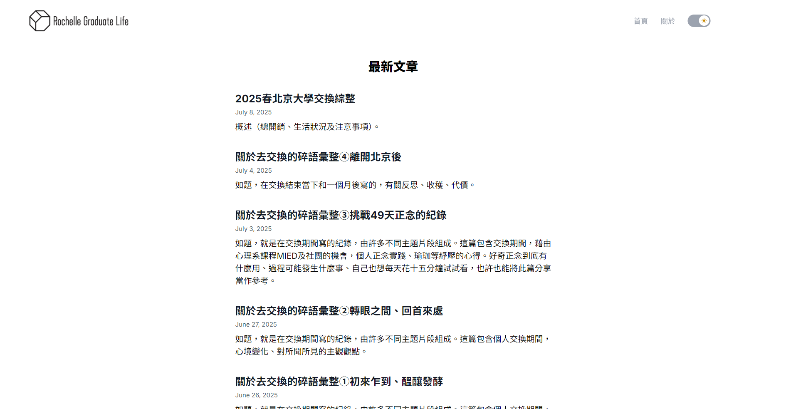

# Rochelle Graduate Life - 個人技術與學術部落格

[**Live Demo 連結**](https://ntnu-blog.vercel.app/)
[**GitHub Repo 連結**](https://github.com/rochelwang1205/ntnu_blog)

這是一個使用 Next.js 13、Tailwind CSS 與 ContentLayer 打造的現代化個人部落格。主要用於記錄研究所在校期間的學術反思、寫作分享，以及前端技術的學習與實踐。

## 專案動機 (Why I built this?)

這個專案的誕生源於三個核心需求：
1.  **技術實踐：** 在碩一的實習經驗中，我觀察到團隊正計畫導入 Next.js 與 SSG 技術。這讓我意識到此技術棧在現代網頁開發中的重要性，並決定透過從零到一的實作，深入掌握其開發流程與優勢，為職涯做好準備。
2.  **寫作平台：** 為研究所期間大量的寫作練習與反思，提供一個自己完全掌控、可以長期經營的平台。
3.  **知識分享：** 希望能將研究所期間的學習心得，特別是「希望在念研究所前就可以知道的事」，分享給未來的學弟妹或有需要的人，發揮正面影響力。

## 主要功能 (Features)

* **✍️ Markdown 寫作：** 透過 ContentLayer 實現，讓文章撰寫與管理流暢高效。
* **🎨 響應式設計 (RWD)：** 使用 Tailwind CSS 確保在桌面與行動裝置上皆有良好的閱讀體驗。
* **🌗 深色/淺色模式切換：** 提供個人化的視覺主題選擇。
* **🚀 高效能靜態生成：** 基於 Next.js 的 SSG (Static Site Generation)，提供極速的頁面載入速度。

## 技術棧 (Tech Stack)

* **框架 (Framework):** Next.js 13 (App Router)
* **樣式 (Styling):** Tailwind CSS
* **內容管理 (Content):** ContentLayer, Markdown/MDX
* **部署 (Deployment):** Vercel

## 未來規劃 (Future Improvements)

* [ ] **標籤分類系統：** 新增文章標籤功能，並實現基於標籤的篩選與導航。
* [ ] **全文搜尋功能：** 整合搜尋方案 (如 Algolia 或自建 API)，提升文章查找效率。
* [ ] **SEO 優化：** 導入 `next-seo` 或 Next.js 內建的 metadata API，提升網站在搜尋引擎的可見度。

## 學習資料 (ref resources)
- 1. https://github.com/3stbn/esteban_site、https://www.youtube.com/watch?v=XGLRr7hrr1w
- 2. https://github.com/Kamigami55/nextjs-tailwind-contentlayer-blog-starter
- 3. https://ithelp.ithome.com.tw/users/20130695/ironman/5397
- 4. https://contentlayer.dev/docs/sources/files/mdx-d747e46d
## Author

- GitHub - [Rochelle Wang](https://github.com/rochelwang1205)
- Twitter - [@RochelWang4](https://twitter.com/RochelWang4)